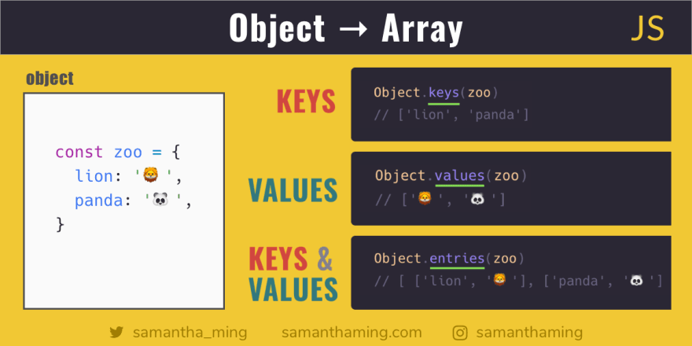
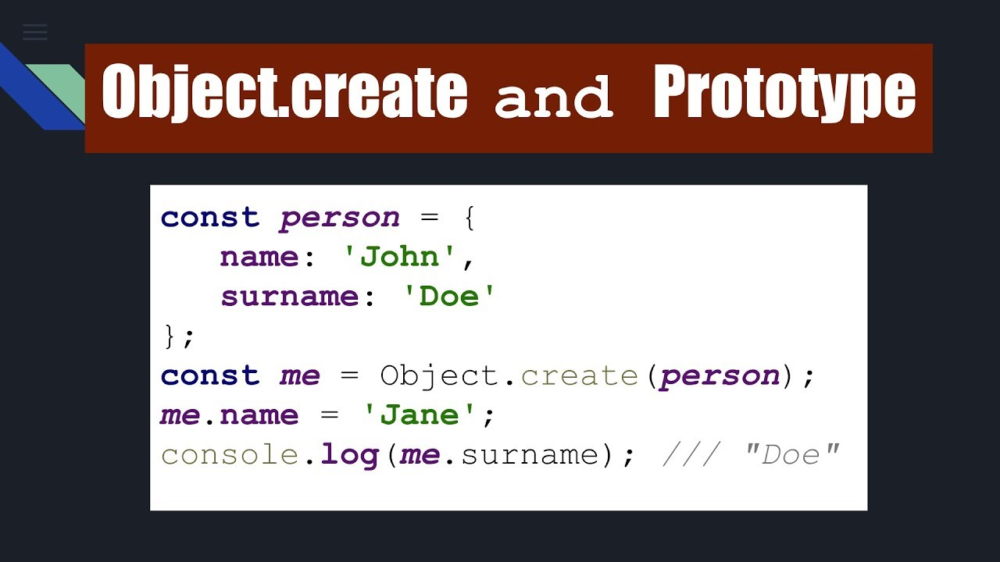
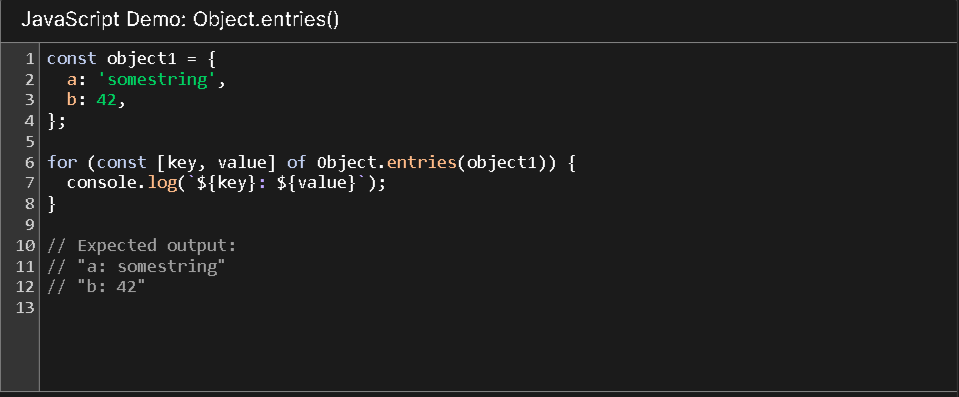
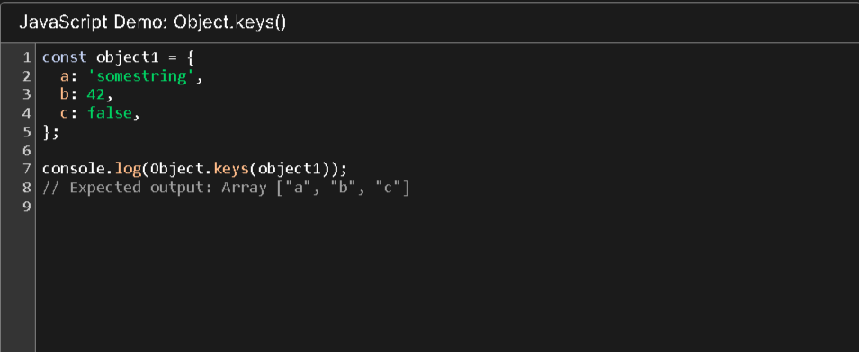
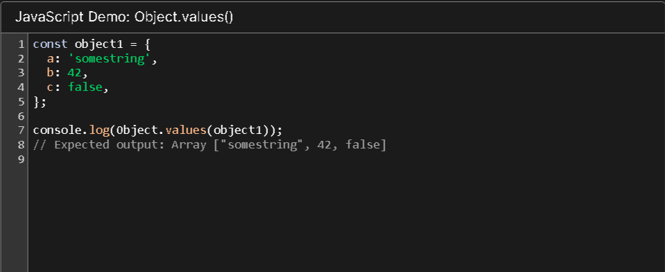
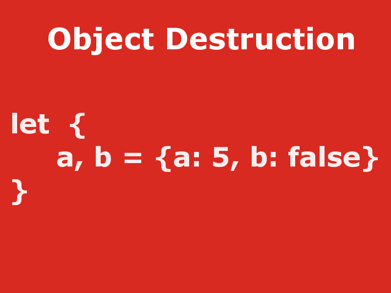
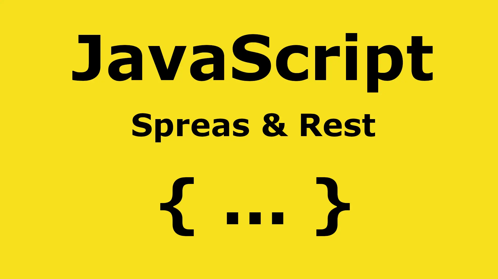
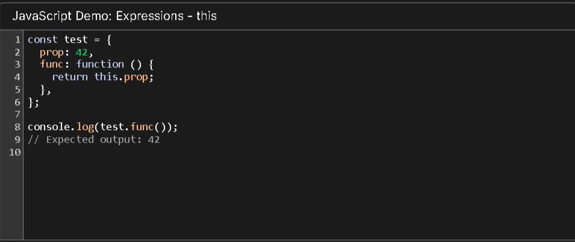

## What is Object in Javascript?
### ObjectТип представляет один из типов данных JavaScript. Он используется для хранения различных коллекций с ключами и более сложных объектов. Объекты могут быть созданы с помощью Object() конструктора или синтаксиса инициализатора объекта / литерала.

## Create Object

## Method Object Entries()
### Object.entries() метод возвращает массив собственных перечисляемых свойств указанного объекта в формате [key, value], в том же порядке, что и в цикле for...in (разница в том, что for-in перечисляет свойства из цепочки прототипов). Порядок элементов в массиве который возвращается Object.entries() не зависит от того как объект объявлен. Если существует необходимость в определённом порядке, то массив должен быть отсортирован до вызова метода, например Object.entries(obj).sort((a, b) => a[0] - b[0]);.

## Method Object Keys()
### Object.keys() Статический метод возвращает массив собственных перечислимых имен свойств данного объекта со строковыми ключами.

## Method Object values()
### Object.values() Статический метод возвращает массив собственных перечислимых значений свойств данного объекта со строковым ключом.

## What is Object Destruction in Javascript?
### Синтаксис деструктурирующего присваивания - это выражение JavaScript, которое позволяет распаковывать значения из массивов или свойства объектов в отдельные переменные.
### Доступ к свойствам объекта можно получить, используя обозначение точками или скобками:

## What is Spread In Javacript?

### Синтаксис расширения (...) позволяет расширять итерируемые объекты, такие как массив или строка, в местах, где ожидается ноль или более аргументов (для вызовов функций) или элементов (для литералов массива). В объектном литерале синтаксис распространения перечисляет свойства объекта и добавляет пары ключ-значение к создаваемому объекту.

## What Is keyword "this" In Javascript?
.jpg>)
### this Ключевое слово функции ведет себя немного по-другому в JavaScript по сравнению с другими языками. Оно также имеет некоторые различия между строгим режимом и нестрогим режимом.
### В большинстве случаев значение this определяется способом вызова функции (привязка во время выполнения). Оно не может быть задано путем присваивания во время выполнения, и оно может отличаться при каждом вызове функции. Function.prototype.bind()Метод может устанавливать значение функции this независимо от того, как она вызывается, а функции со стрелками не предоставляют свою собственную this привязку (она сохраняет this значение заключающего в себе лексического контекста).
